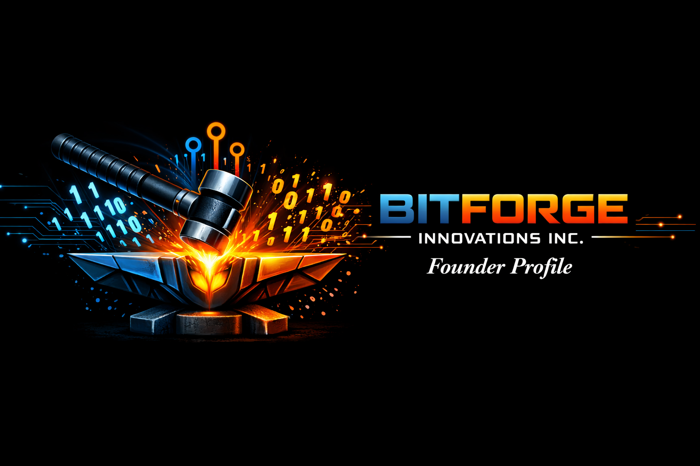

# **Bitforge Founder Profile**

## **👤 Founder: Davis (B) — Bitforge Innovations Inc.**

I’m a systems‑minded developer and founder building **Bitforge Innovations Inc.**, a company focused on modular tooling, intelligent memory systems, and next‑generation workflow infrastructure. My background spans low‑level C development, UI/UX tool architecture, IT consulting, hardware prototyping, and emerging AI‑driven systems.

Bitforge is built on the idea that **information should be forged, shaped, and refined** — not just stored. Every tool, module, and system we create follows that philosophy.

---

## **🔥 Bitforge Mission Statement**

**Forge intelligence. Shape information. Build tools that think with you.**

Bitforge Innovations Inc. exists to create:
- modular, node‑based workflow tools  
- intelligent memory systems  
- portable UI applications  
- hardware‑software hybrid prototypes  
- educational and consulting solutions  

Our goal is to empower developers, creators, and businesses with tools that feel alive — tools that adapt, remember, and evolve.

---

## **🛠️ Current Projects**

### **AI‑Memory‑Layer**
A public‑facing implementation of Bitforge’s memory architecture, designed to:
- visualize cognitive paths  
- color‑code memory states  
- debug AI reasoning  
- support modular resolution routing  

Repo:  
**[https://github.com/bdavez/AI-Memory-Layer](https://github.com/bdavez/AI-Memory-Layer)**

---

### **Kanban UI (Tauri + TypeScript)**
A portable, native-feeling Kanban tool with:
- dynamic columns  
- drag‑and‑drop tasks  
- modular UI nodes  
- Bitforge‑style workflow logic  

Repo:  
**[https://github.com/bdavez/kanban](https://github.com/bdavez/kanban)**

---

### **Zercher C++ Game**
A Wonderland‑themed external TXT content system integrated into a C++ game engine.

Repo:  
**[https://github.com/bdavez/Zercher---CPP-Game](https://github.com/bdavez/Zercher---CPP-Game)**

---

## **📡 Infrastructure**

Bitforge runs on a custom datacenter stack including:
- Local and cloud‑synced development environments  

---

## **📬 Contact**

**Email:** bitforge.intelligence@gmail.com  
**GitHub:** [https://github.com/bdavez](https://github.com/bdavez)  
**Company:** Bitforge Innovations Inc.

---

## **⚙️ Vision**

Bitforge is not just a set of tools — it’s a philosophy:

**Information is raw material.  
Tools are the forge.  
Intelligence is the product.**

We build systems that help people think better, create faster, and understand deeper.
